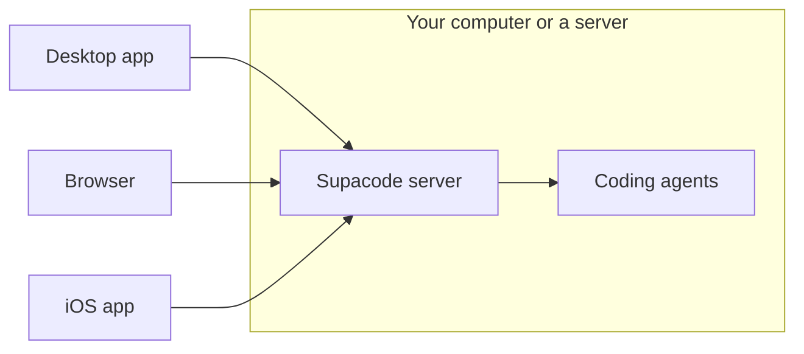

# Supacode

A command center for your coding agents.



## Get started

1. Install the [desktop app](https://next.supacode.sh) or the command line:

   ```sh
   curl -fsSL https://next.supacode.sh/install.sh | sh
   ```

   On Windows: `irm https://next.supacode.sh/install.ps1 | iex`

2. Open the app or run `supacode`, then enable a provider in **Settings → Providers**.
3. To connect from the [iOS app](https://testflight.apple.com/join/ga2vGT3h) or another computer, follow [remote access](./docs/user/remote-access.md). On a Linux or macOS server, `supacode service install` keeps it running.

[Documentation](./docs/README.md) · Fork of [t3code](https://github.com/pingdotgg/t3code)
